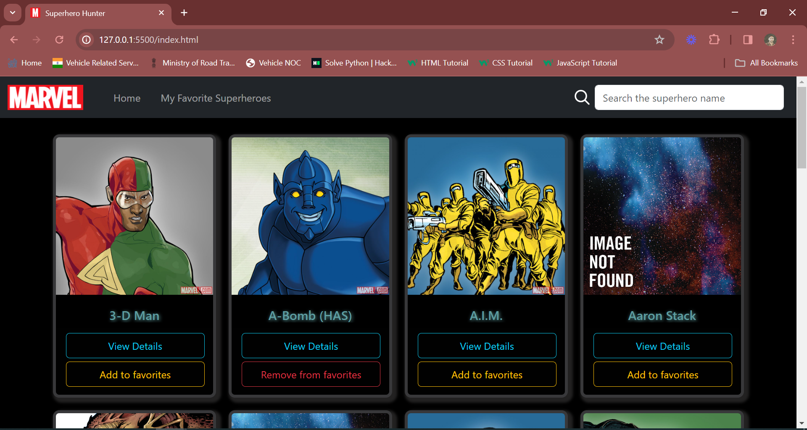

# Superhero Hunter App

Website is live at: https://ravikantsingh12.github.io/Superhero-Hunter-App/

## Overview

Superhero Hunter is a web application that allows users to explore information about various superheroes from the Marvel Universe. Users can search for superheroes, view their details, and add them to their favorites list.

## Features

1. **Homepage:**
   - Navigation bar with options to go to the homepage, view favorite superheroes, and search for superheroes.
   - Search functionality to search for superheroes by name.
   - Display of superhero cards containing their name, image, and options to view details or add/remove them from favorites.

2. **Superhero Details Page:**
   - Displays detailed information about a selected superhero.
   - Shows the superhero's name, ID, number of stories, comics, events, series, and description.
   - Allows users to navigate back to the homepage.

3. **Favorites Page:**
   - Displays a list of favorite superheroes.
   - Allows users to remove superheroes from their favorites list.
   - Shows a message if no superheroes have been added to favorites yet.

## Technologies Used

- **HTML:** Used for structuring the web pages and creating the user interface.
- **CSS:** Used for styling the web pages and making them visually appealing.
- **JavaScript:** Used for adding interactivity to the web pages, fetching data from the Marvel API, and managing favorites.
- **Bootstrap:** Used for responsive design and styling components.
- **Marvel API:** Used for retrieving information about superheroes.

## Project Screenshots

1. **Homepage:**
   

2. **Homepage:** When no superhero found in the result with the name searched
   
   
3. **Superhero Details Page:**
   
   
4. **Favorites Page:**
   

5.  **Favorites Page:** When no superhero added to the favorite
   

## Usage

1. **Homepage:**
   - Upon loading the homepage, users can browse through the list of superheroes.
   - Use the search bar to find specific superheroes by name.
   - Click on "View Details" to see more information about a superhero.
   - Add or remove superheroes from favorites by clicking the corresponding button.

2. **Superhero Details Page:**
   - View detailed information about a selected superhero, including their name, ID, stories, comics, series, and description.
   - Click on "Go to Homepage" to return to the homepage.

3. **Favorites Page:**
   - Displays a list of favorite superheroes added by the user.
   - Click on "Remove from favorites" to remove a superhero from the favorites list.

## Credits

- Marvel API: Used for retrieving superhero data.
- Bootstrap: Used for responsive design and styling components.
- Font Awesome: Used for icons.

## Author

Ravikant Singh - 1210ravi.singh@gmail.com
